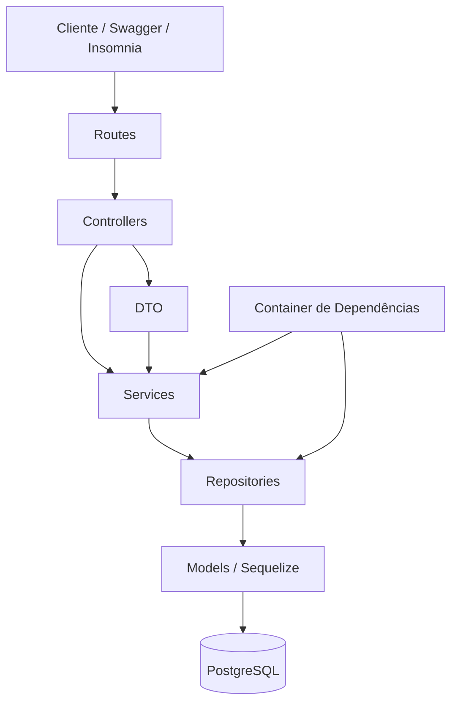

# Arquitetura do Projeto

## 1. Visão geral

O projeto é uma API REST para gerenciamento de um Banco de Questões de Matemática.

A aplicação foi desenvolvida inicialmente nos Trabalhos 1 e 2 e, no Trabalho 3, passou por uma refatoração arquitetural com o objetivo de melhorar a separação de responsabilidades, reduzir o acoplamento e facilitar manutenção e testes.

A arquitetura adotada combina:

- Arquitetura em camadas;
- MVC adaptado para API REST;
- Repository;
- Injeção de Dependência;
- DTO (Data Transfer Object).

A refatoração preserva os endpoints e o comportamento externo da API.

---

## 2. Estrutura principal

```text
Trabalho 1 API/
│
├── config/
├── migrations/
├── models/
├── seeders/
│
├── docs/
│   └── adr/
│       ├── 001-arquitetura-em-camadas.md
│       └── 002-injecao-de-dependencia.md
│
├── src/
│   ├── config/
│   │   └── container.js
│   │
│   ├── controllers/
│   │   ├── questoes.controller.js
│   │   ├── disciplinas.controller.js
│   │   ├── categorias.controller.js
│   │   └── assuntos.controller.js
│   │
│   ├── dtos/
│   │   └── questao.dto.js
│   │
│   ├── middlewares/
│   │   └── erro.middleware.js
│   │
│   ├── repositories/
│   │   ├── questoes.repository.js
│   │   ├── disciplinas.repository.js
│   │   ├── categorias.repository.js
│   │   └── assuntos.repository.js
│   │
│   ├── routes/
│   ├── services/
│   ├── docs/
│   │   └── openapi.yaml
│   │
│   └── app.js
│
├── ARQUITETURA.md
├── README.md
├── package.json
└── package-lock.json
```

---

## 3. Diagrama das camadas



Fluxo principal:

```text
Cliente
   ↓
Routes
   ↓
Controllers
   ↓
Services
   ↓
Repositories
   ↓
Models / Sequelize
   ↓
PostgreSQL
```

---

## 4. Responsabilidade de cada camada

### Routes

As rotas definem os endpoints da API e indicam qual controller deve ser executado.

Exemplos:

```text
GET /questoes
POST /questoes
GET /disciplinas
GET /categorias
GET /assuntos
```

As rotas não contêm regras de negócio e não acessam diretamente o banco de dados.

### Controllers

Os controllers são responsáveis pela comunicação HTTP.

Eles:

- recebem a requisição;
- acessam parâmetros da URL;
- recebem dados do body;
- acessam query parameters;
- chamam o service;
- definem o código HTTP;
- devolvem a resposta ao cliente;
- encaminham erros ao middleware.

Os controllers não acessam diretamente o Sequelize nem os repositories.

### Services

Os services concentram as regras da aplicação e a organização dos casos de uso.

Entre suas responsabilidades estão:

- verificar se um registro existe;
- validar informações obrigatórias;
- definir situações de erro;
- coordenar operações;
- chamar os repositories.

Dessa forma, os controllers permanecem focados na comunicação HTTP.

### Repositories

Os repositories concentram o acesso aos dados.

Nessa camada são utilizadas operações do Sequelize como:

```text
findAll
findByPk
findAndCountAll
create
update
destroy
include
```

Também ficam nos repositories:

- filtros;
- paginação;
- ordenação;
- relacionamentos;
- transações.

Assim, as outras camadas não precisam conhecer diretamente os detalhes do ORM.

### Models

Os models representam as entidades persistidas no banco de dados.

As principais entidades são:

- Questão;
- Disciplina;
- Categoria;
- Assunto.

Relacionamentos:

```text
Disciplina 1:N Questões
Categoria 1:N Questões
Questões N:N Assuntos
```

O relacionamento muitos-para-muitos utiliza a tabela associativa `questao_assuntos`.

### DTOs

Os DTOs controlam os dados que entram na aplicação.

Foi criado:

```text
src/dtos/questao.dto.js
```

Ele é utilizado principalmente nas operações:

```text
POST /questoes
PUT /questoes/:id
PATCH /questoes/:id
```

O DTO organiza os dados recebidos antes de enviá-los para o service.

### Middlewares

Os middlewares tratam preocupações utilizadas em diferentes partes da aplicação.

O projeto possui um middleware centralizado de erros, responsável por respostas como:

```text
400 - Dados inválidos
404 - Recurso não encontrado
409 - Conflito
500 - Erro interno
503 - Falha de conexão com o banco
```

### Container de Dependências

O arquivo:

```text
src/config/container.js
```

é responsável por montar as dependências da aplicação.

Ele conecta cada repository ao seu respectivo service.

Exemplo:

```text
Questões Repository
        ↓
     Container
        ↓
Questões Service
```

O service recebe o repository que irá utilizar, em vez de importar diretamente uma implementação específica.

---

## 5. Aplicação do MVC

O projeto também utiliza conceitos do padrão MVC.

### Model

O Model é representado principalmente pelos arquivos da pasta:

```text
models/
```

Eles representam os dados e relacionamentos utilizados pelo Sequelize.

### Controller

O Controller é representado pelos arquivos existentes em:

```text
src/controllers/
```

Eles recebem as requisições HTTP e encaminham as operações para os services.

### View

Como o projeto é uma API REST, não existe uma interface gráfica tradicional.

A representação dos dados é feita principalmente por respostas JSON enviadas ao cliente.

---

## 6. Fluxo completo de uma requisição

Exemplo:

```text
GET /questoes/1
```

### 1. Cliente

O cliente envia:

```text
GET /questoes/1
```

### 2. Route

A rota identifica o endpoint e chama o controller correspondente.

```text
questoes.routes.js
        ↓
questoes.controller.js
```

### 3. Controller

O controller recebe o `id` da URL e chama:

```text
service.buscarQuestaoPorId(id)
```

### 4. Service

O service chama:

```text
repository.buscarPorId(id)
```

O service também verifica se a questão existe.

Caso não exista, gera um erro `404`.

### 5. Repository

O repository utiliza o Sequelize para realizar a consulta ao banco.

Exemplo:

```text
Questao.findByPk(...)
```

Também podem ser carregados os relacionamentos com Disciplina, Categoria e Assuntos.

### 6. Banco

O Sequelize executa a consulta no PostgreSQL.

### 7. Retorno

Os dados percorrem o caminho inverso:

```text
PostgreSQL
    ↓
Repository
    ↓
Service
    ↓
Controller
    ↓
JSON
    ↓
Cliente
```

---

## 7. Padrões de projeto utilizados

Foram utilizados três padrões principais.

### 7.1 Repository

#### Problema

Sem uma camada específica de persistência, as consultas ao banco poderiam ficar espalhadas por controllers e services.

Isso aumentaria o acoplamento com o Sequelize.

#### Decisão

Foi criada a camada:

```text
src/repositories/
```

Ela concentra as operações de persistência.

#### Benefícios

- isolamento do ORM;
- menor acoplamento;
- facilidade de manutenção;
- melhor organização;
- possibilidade de substituir a implementação de persistência com menor impacto.

#### Sem esse padrão

Controllers ou services poderiam acessar diretamente o Sequelize, tornando o sistema mais difícil de testar e manter.

---

### 7.2 Injeção de Dependência

#### Problema

Inicialmente, cada service importava diretamente seu repository.

Isso criava uma dependência forte entre as implementações.

#### Decisão

Os services passaram a receber os repositories por parâmetro.

A montagem é feita em:

```text
src/config/container.js
```

Exemplo:

```text
criarQuestoesService(questoesRepository)
```

#### Benefícios

- redução do acoplamento;
- maior facilidade para testes;
- possibilidade de trocar implementações;
- dependências configuradas em um único lugar.

#### Sem esse padrão

Cada service ficaria diretamente ligado a um repository específico, dificultando testes isolados e substituições futuras.

---

### 7.3 DTO

#### Problema

O controller de Questões precisava montar manualmente os dados recebidos pelo `req.body` em diferentes operações.

Isso gerava repetição.

#### Decisão

Foi criado:

```text
src/dtos/questao.dto.js
```

com funções responsáveis por organizar os dados de entrada.

#### Benefícios

- menor repetição;
- controllers mais simples;
- controle sobre os campos recebidos;
- facilidade para alterar o formato de entrada futuramente.

#### Sem esse padrão

A montagem dos objetos continuaria repetida em vários métodos dos controllers.

---

## 8. Dependências entre camadas

A regra principal é:

```text
Route
  ↓
Controller
  ↓
Service
  ↓
Repository
  ↓
Model / Banco
```

Uma camada não deve pular níveis.

Por exemplo:

```text
Controller → Repository
```

não deve acontecer.

Também não deve existir:

```text
Controller → Sequelize
```

O acesso ao ORM fica concentrado na camada de repository.

---

## 9. Preservação do comportamento

Após a refatoração, foram testados os endpoints principais:

```text
GET /questoes
GET /disciplinas
GET /categorias
GET /assuntos
GET /disciplinas/1/questoes
```

Também foram testadas operações de escrita:

```text
POST /questoes
PATCH /questoes/:id
DELETE /questoes/:id
```

A criação retornou `201`, a atualização retornou `200` e a exclusão retornou `204`.

A documentação Swagger também permaneceu disponível.

Assim, a reorganização alterou a estrutura interna sem modificar o comportamento esperado da API.

---

## 10. Qualidade do código

O projeto utiliza ESLint para verificar problemas no código.

Comando utilizado:

```bash
npx eslint .
```

Resultado final:

```text
0 erros
0 warnings
```

Também foi utilizada a ferramenta Madge para verificar dependências circulares:

```bash
npx madge --circular src
```

Resultado:

```text
No circular dependency found!
```

Também foi verificado que controllers, services e routes não utilizam diretamente operações do Sequelize.

---

## 11. Benefícios da arquitetura adotada

A refatoração trouxe:

- melhor separação de responsabilidades;
- redução do acoplamento;
- controllers menores;
- regras concentradas nos services;
- acesso ao banco concentrado nos repositories;
- maior facilidade para testes;
- manutenção mais simples;
- maior organização do projeto;
- possibilidade de evolução futura com menor impacto.

Antes:

```text
Route → Controller → Repository
```

Depois:

```text
Route → Controller → Service → Repository
```

Com Injeção de Dependência:

```text
Repository
     ↓
Container
     ↓
Service
```

---

## 12. Conclusão

A refatoração não alterou o objetivo da API, mas reorganizou sua estrutura interna.

O projeto passou a utilizar uma arquitetura em camadas com responsabilidades mais bem definidas e conceitos de MVC.

Os padrões Repository, Injeção de Dependência e DTO foram aplicados para resolver problemas reais do projeto, evitando adicionar complexidade sem necessidade.

Com essa estrutura, a API fica mais organizada, testável e preparada para futuras manutenções e evoluções.