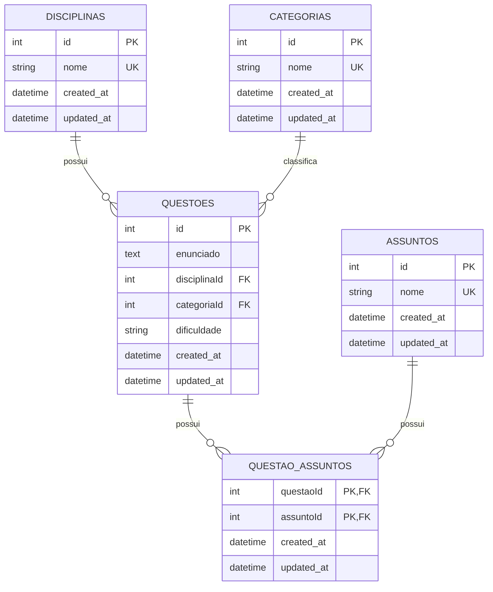

# API Banco de Questões de Matemática

Projeto desenvolvido para a disciplina de Desenvolvimento de Software.

O projeto consiste em uma API REST para gerenciamento de um Banco de Questões de Matemática. Nesta segunda etapa, a aplicação foi evoluída para utilizar persistência de dados em banco de dados relacional PostgreSQL por meio do framework ORM Sequelize.

A API permite cadastrar e gerenciar questões, disciplinas, categorias e assuntos, utilizando relacionamentos entre as tabelas, migrations, seeders, transações, paginação, filtros e tratamento de erros.

## Tecnologias utilizadas

- Node.js
- Express
- PostgreSQL
- Sequelize ORM
- Sequelize CLI
- JavaScript
- Swagger / OpenAPI
- Insomnia
- dotenv

## Recursos da API

A API possui quatro recursos principais:

- Questões
- Disciplinas
- Categorias
- Assuntos

Os dados são armazenados no PostgreSQL e acessados por meio do Sequelize ORM.

## Modelo de dados

O banco possui as seguintes tabelas principais:

- `questoes`
- `disciplinas`
- `categorias`
- `assuntos`

Também existe a tabela associativa:

- `questao_assuntos`

Ela é utilizada para implementar o relacionamento muitos-para-muitos entre questões e assuntos.

## Diagrama Entidade-Relacionamento



## Relacionamentos

### Disciplina e Questões

Uma disciplina pode possuir várias questões.

Relacionamento:

`Disciplina 1:N Questões`

A chave estrangeira `disciplinaId` está presente na tabela `questoes`.

### Categoria e Questões

Uma categoria pode possuir várias questões.

Relacionamento:

`Categoria 1:N Questões`

A chave estrangeira `categoriaId` está presente na tabela `questoes`.

### Questões e Assuntos

Uma questão pode possuir vários assuntos e um assunto pode estar relacionado a várias questões.

Relacionamento:

`Questões N:N Assuntos`

Esse relacionamento é implementado pela tabela associativa `questao_assuntos`.

## Integridade dos dados

As tabelas utilizam:

- Chaves primárias
- Chaves estrangeiras
- Campos obrigatórios com `NOT NULL`
- Restrição `UNIQUE`
- Valor padrão
- Campos de auditoria `created_at` e `updated_at`

O campo `dificuldade` das questões possui o valor padrão:

`media`

A API também verifica a existência das chaves estrangeiras antes de criar ou atualizar uma questão.

Caso uma disciplina, categoria ou assunto informado não exista, a API retorna o código HTTP `404`.

## Migrations

A estrutura do banco de dados é controlada por migrations versionadas do Sequelize.

Entre as migrations do projeto estão:

- Criação da tabela de disciplinas
- Criação da tabela de categorias
- Criação da tabela de questões
- Criação da tabela de assuntos
- Criação da tabela associativa `questao_assuntos`
- Evolução do campo `dificuldade`, incluindo valor padrão
- Padronização dos campos de auditoria para `created_at` e `updated_at`

Para executar as migrations:

```bash
npx sequelize-cli db:migrate
```

Para consultar o estado das migrations:

```bash
npx sequelize-cli db:migrate:status
```

## Seeders

O projeto possui seed para popular o banco com dados iniciais.

São inseridos registros para disciplinas, categorias, assuntos e questões, além dos respectivos relacionamentos.

Para executar os seeders:

```bash
npx sequelize-cli db:seed:all
```

## Transações

A aplicação utiliza transações do Sequelize nas operações que envolvem questões e assuntos.

Ao criar uma questão com assuntos, a questão e seus relacionamentos são gravados dentro de uma transação.

Se ocorrer algum erro durante a operação, é realizado `rollback`, evitando que o banco fique com dados parcialmente gravados.

## Paginação

A listagem de questões utiliza paginação diretamente no banco de dados por meio de `LIMIT` e `OFFSET`.

Exemplo:

```text
GET /questoes?page=1&limit=10
```

## Filtros

É possível filtrar questões pela dificuldade.

Exemplo:

```text
GET /questoes?dificuldade=facil
```

Também é possível realizar busca pelo enunciado:

```text
GET /questoes?busca=porcentagem
```

## Ordenação

A listagem de questões permite configurar o campo e a direção da ordenação.

Exemplo:

```text
GET /questoes?ordenar=id&direcao=desc
```

Os valores de direção aceitos são:

- `asc`
- `desc`

## Endpoint de dados relacionados

A API possui uma rota para consultar as questões relacionadas a uma disciplina:

```text
GET /disciplinas/{id}/questoes
```

Exemplo:

```text
GET /disciplinas/1/questoes
```

As consultas de questões também utilizam os relacionamentos do Sequelize para retornar disciplina, categoria e assuntos relacionados.

## Tratamento de erros

A API possui middleware centralizado para tratamento de erros.

Entre os códigos HTTP utilizados estão:

- `200` - operação realizada com sucesso
- `201` - recurso criado
- `204` - recurso excluído
- `400` - dados inválidos
- `404` - recurso não encontrado
- `409` - conflito ou violação de integridade
- `500` - erro interno
- `503` - falha de conexão com o banco de dados

Por exemplo, uma disciplina que possui questões relacionadas não pode ser excluída. Nesse caso, a API retorna `409 Conflict`, preservando a integridade referencial do banco.

## Estrutura do projeto

```text
Trabalho 1 API/
│
├── config/
│   └── config.js
│
├── migrations/
│
├── models/
│   ├── index.js
│   ├── questao.js
│   ├── disciplina.js
│   ├── categoria.js
│   └── assunto.js
│
├── seeders/
│
├── src/
│   ├── controllers/
│   ├── docs/
│   │   └── openapi.yaml
│   ├── middlewares/
│   ├── repositories/
│   ├── routes/
│   └── app.js
│
├── .env.example
├── .gitignore
├── .sequelizerc
├── package.json
└── README.md
```

## Configuração do ambiente

Crie um arquivo `.env` na raiz do projeto utilizando o `.env.example` como referência.

Exemplo:

```env
DB_USERNAME=postgres
DB_PASSWORD=sua_senha
DB_DATABASE=banco_questoes
DB_HOST=127.0.0.1
DB_PORT=5432
DB_DIALECT=postgres
```

O arquivo `.env` não deve ser enviado para o repositório, pois contém informações privadas de acesso ao banco de dados.

## Como executar o projeto

### 1. Instalar as dependências

```bash
npm install
```

### 2. Configurar o PostgreSQL

Certifique-se de que o PostgreSQL esteja instalado e em execução.

Configure as informações de acesso no arquivo `.env`.

### 3. Criar o banco de dados

```bash
npx sequelize-cli db:create
```

### 4. Executar as migrations

```bash
npx sequelize-cli db:migrate
```

### 5. Popular o banco

```bash
npx sequelize-cli db:seed:all
```

### 6. Iniciar a API

```bash
node src/app.js
```

A aplicação ficará disponível em:

```text
http://localhost:3000
```

## Documentação Swagger

Com o servidor em execução, a documentação interativa da API pode ser acessada em:

```text
http://localhost:3000/api-docs
```

O Swagger apresenta as rotas disponíveis e permite visualizar os métodos HTTP e os dados esperados pela API.

## Principais endpoints

### Questões

```text
GET    /questoes
GET    /questoes/:id
POST   /questoes
PUT    /questoes/:id
PATCH  /questoes/:id
DELETE /questoes/:id
```

### Disciplinas

```text
GET    /disciplinas
GET    /disciplinas/:id
POST   /disciplinas
PUT    /disciplinas/:id
PATCH  /disciplinas/:id
DELETE /disciplinas/:id

GET    /disciplinas/:id/questoes
```

### Categorias

```text
GET    /categorias
GET    /categorias/:id
POST   /categorias
PUT    /categorias/:id
PATCH  /categorias/:id
DELETE /categorias/:id
```

### Assuntos

```text
GET    /assuntos
GET    /assuntos/:id
POST   /assuntos
PUT    /assuntos/:id
PATCH  /assuntos/:id
DELETE /assuntos/:id
```

## Exemplo de criação de questão

Requisição:

```text
POST /questoes
```

Body:

```json
{
    "enunciado": "Qual é 20% de 100?",
    "disciplinaId": 1,
    "categoriaId": 1,
    "dificuldade": "facil",
    "assuntoIds": [1, 2]
}
```

A operação cria a questão e seus relacionamentos com os assuntos utilizando uma transação.

## Arquitetura

O projeto utiliza separação de responsabilidades:

- **Routes:** definição das rotas HTTP.
- **Controllers:** recebem as requisições e retornam as respostas.
- **Repositories:** concentram o acesso ao banco de dados por meio do Sequelize.
- **Models:** representam as entidades e seus relacionamentos.
- **Middlewares:** realizam o tratamento centralizado de erros.
- **Migrations:** controlam a evolução da estrutura do banco.
- **Seeders:** inserem os dados iniciais.

Dessa forma, os controllers não realizam consultas diretamente no banco de dados, mantendo o acesso aos dados concentrado nos repositories.